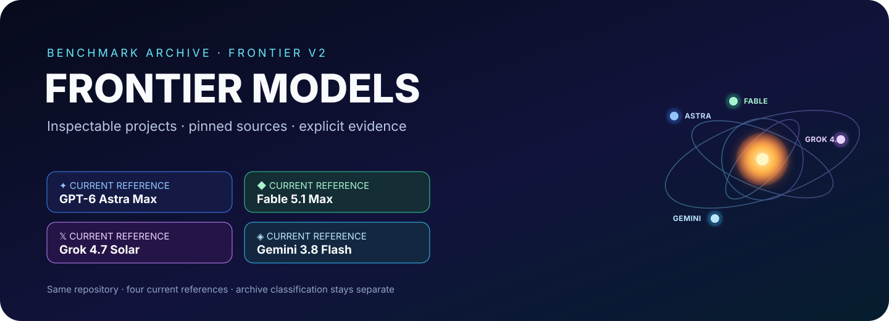
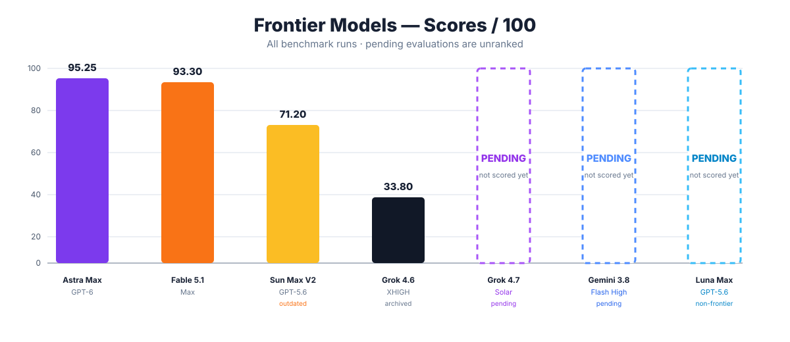

<div align="center">



<br/>

[](./benchmarks)
[](./benchmarks/solar-system/RUNS.json)
[](./benchmarks/solar-system/RUNS.json)

# Frontier Models

**Prompts exatos. Proveniência fixada. Snapshots completos dos projetos. Evidências explícitas.**

[](./README.md)

[Abrir benchmark](./benchmarks/solar-system/) · [Metodologia](./docs/METHODOLOGY.md)

</div>

## ⚔️ Arena Frontier V2 atual

| Modelo | Execução / esforço | Projeto ao vivo | Execução arquivada / fixada |
| --- | --- | --- | --- |
| ✦ **GPT-6 Astra Max** | Frontier V2 / Max | [Abrir Astra](https://gpt-6-astra.biel.dev.br) | [`runs/gpt-6-astra-max/frontier-v2`](./benchmarks/solar-system/runs/gpt-6-astra-max/frontier-v2/) |
| 𝕏 **Grok 4.7 Solar** | Referência com fonte fixada | [Abrir Observatório do Sistema Solar](https://grok-4.7.biel.dev.br/) | [`runs/grok-4.7/source`](./benchmarks/solar-system/runs/grok-4.7/source/) |
| ◆ **Fable 5.1** | Frontier V2 / **Max** | [Abrir Fable 5.1](https://fable-solar-system.vercel.app) | [`runs/fable/frontier-v2`](./benchmarks/solar-system/runs/fable/frontier-v2/) |
| ◈ **Gemini 3.8 Flash** | Frontier V2 / **High** | [Abrir Gemini 3.8 Flash](https://gemini-3.8-flash.biel.dev.br) | [`runs/gemini-3.8-flash/frontier-v2`](./benchmarks/solar-system/runs/gemini-3.8-flash/frontier-v2/) |

A arena atual acompanha quatro referências frontier. GPT-6 Astra Max, Fable 5.1 e Gemini 3.8 Flash mantêm metadados Frontier V2; o Grok 4.7 Solar está fixado a um repositório público e sua proveniência de prompt não foi arquivada aqui.

## 🗂️ Modelos non-frontier ou desatualizados

Estas execuções continuam visíveis como referência, mas ficam intencionalmente separadas da arena frontier atual e do SVG principal. A classificação da arena é separada do quadro de pontuações: execuções históricas/desatualizadas já avaliadas continuam visíveis nele, enquanto as ainda não avaliadas ficam sem posição.

| Modelo | Classificação | Projeto / fonte | Proveniência | Situação da nota |
| --- | --- | --- | --- | --- |
| ☀️ **GPT-5.6 Sun Max V2** | Frontier desatualizado | [Abrir Sun V2](https://gpt-5.6-sun-v2.biel.dev.br) | [`runs/gpt-5.6-sun-max/rebuild`](./benchmarks/solar-system/runs/gpt-5.6-sun-max/rebuild/) · commit `93d43ae62f…` | **71,20/100** histórica |
| 🌙 **GPT-5.6 Luna Max** | Non-frontier | [Abrir Luna](https://gpt-5.6-luna.biel.dev.br) · [Repositório fonte](https://github.com/bielxdh3/orbitario-luna) | commit [`5fdc036884…`](https://github.com/bielxdh3/orbitario-luna/commit/5fdc036884bbeb712eb015c76db1b1eaf83c9e42) | **Avaliação pendente** |
| 𝕏 **Grok 4.6** | Execução frontier arquivada | [Abrir Grok 4.6](https://grok-4-6-solar-system.vercel.app) | [`runs/grok-4.6/frontier-v2`](./benchmarks/solar-system/runs/grok-4.6/frontier-v2/) | **33,80/100** histórica |

O Luna Max está, por enquanto, apenas com a fonte fixada; a proveniência do prompt ainda não foi arquivada neste repositório.

## O que é Frontier Models?

**Frontier Models** é um arquivo de benchmarks para comparar sistemas de IA frontier em projetos completos e inspecionáveis, em vez de capturas isoladas ou pontuações sintéticas.

```text
PROMPT → EXECUÇÃO DO MODELO → SNAPSHOT / FONTE FIXADA → EVIDÊNCIAS → SCORECARD → VEREDITO
```

## Benchmark 001 — Sistema Solar / Orbitário

O primeiro benchmark pede a cada modelo que construa um produto completo e interativo do Sistema Solar a partir de uma especificação extensa. Ele testa design de produto, simulação e lógica orbital, câmera/navegação, estado temporal, acessibilidade, desempenho, robustez, honestidade científica, ferramentas educacionais e QA.

## Proveniência das execuções

| Modelo | Proveniência | Classificação | Status da fonte |
| --- | --- | --- | --- |
| GPT-6 Astra Max | commit `fca2ef51b4…` | Frontier atual | Arquivado |
| Grok 4.7 Solar | commit `bcb1e82012…` em `JouberthAlves/grok-4.7-solar` | Frontier atual | Fonte fixada |
| Fable 5.1 Max | commit `7e079669e41b…` | Frontier atual | Arquivado |
| Gemini 3.8 Flash High | commit `805cfe87a…` em `bielxdh3/gemini` | Frontier atual | Fonte fixada |
| GPT-5.6 Sun Max V2 | commit `93d43ae62f…` | Desatualizado | Arquivado |
| Grok 4.6 XHIGH | SHA-256 do ZIP `5d77eeb509…` | Frontier arquivado | Arquivado |
| GPT-5.6 Luna Max | commit `5fdc036884…` em `bielxdh3/orbitario-luna` | Non-frontier | Fonte fixada |

O prompt compartilhado exato é [`frontier-v2.md`](./benchmarks/solar-system/prompts/frontier-v2.md), SHA-256 `7c2833a0486938c38671139807bd4a8c16371c3740175376ad02a6c0c3c06d65`.

## Pontuações do benchmark

> **Avaliação preliminar:** as notas atuais foram feitas principalmente por um único avaliador e em poucos dispositivos/ambientes. Grok 4.7 Solar, Gemini 3.8 Flash High e GPT-5.6 Luna Max **ainda não foram pontuados**. Pendente não significa zero; o Sun Max V2 continua visível com sua nota histórica mesmo não fazendo mais parte da arena frontier.

<div align="center">



</div>

| Posição | Modelo | Nota |
| ---: | --- | ---: |
| **1** | GPT-6 Astra Max | **95,25/100** |
| **2** | Fable 5.1 Max | **93,30/100** |
| **3** | GPT-5.6 Sun Max V2 | **71,20/100** |
| **4** | Grok 4.6 XHIGH | **33,80/100** |
| — | Grok 4.7 Solar | **Pendente** |
| — | Gemini 3.8 Flash High | **Pendente** |
| — | GPT-5.6 Luna Max | **Pendente** |

## Critérios de avaliação — resumo

- **Completude de recursos — 20 pts:** os recursos exigidos precisam existir de verdade e entregar o comportamento pretendido; implementações falsas, superficiais ou feitas para contornar a intenção perdem pontos.
- **Interação / UX — 15 pts:** clareza, descobribilidade, ergonomia e fluxo dos controles quando o produto funciona como projetado; bugs de implementação **não** viram automaticamente problemas de UX.
- **Execução visual — 15 pts:** hierarquia, legibilidade, coerência, qualidade de renderização e acabamento.
- **Fidelidade científica / da simulação — 15 pts:** correção orbital, temporal, de escala e astronômica, incluindo limites de aproximação explicados com honestidade.
- **Robustez — 10 pts:** bugs, dessincronização de estado, câmera/seguimento quebrados, exceções, estado corrompido e recursos que deixam de funcionar.
- **Desempenho — 10 pts:** responsividade, estabilidade dos frames, carregamento e eficiência de recursos.
- **Código / arquitetura — 10 pts:** manutenibilidade, modularidade, limites de estado, dependências, testabilidade e qualidade da validação.
- **Acessibilidade / responsividade — 5 pts:** teclado/foco, movimento reduzido, usabilidade semântica e adaptação do layout aos tamanhos de tela-alvo.

**Sem dupla penalização:** um defeito deve perder pontos na categoria principal à qual pertence, salvo quando houver evidência independente de outra violação. Exemplo: se o Sol seguir a câmera/usuário por estado de cena ou seguimento quebrado, isso é **Robustez**, não UX.

Veja as evidências detalhadas e notas por categoria em [`SCORECARD.md`](./benchmarks/solar-system/comparison/SCORECARD.md).

## Política do arquivo

- resultados dos modelos permanecem intocados dentro dos snapshots arquivados em `runs/`;
- material do avaliador fica fora dos resultados dos modelos;
- prompts exatos são arquivados separadamente e sem alterações;
- commits Git são usados quando existem metadados Git da fonte;
- hashes criptográficos são usados quando não existem;
- uma fonte pode ficar fixada por commit enquanto o snapshot vendorizado ainda estiver pendente;
- execuções históricas continuam preservadas sem poluir a arena atual.

---

<div align="center">

### Frontier Models

**Entrada · resultado · evidência · comparação — tudo em um só lugar.**

<sub>Arquivo independente de benchmark. Os nomes dos modelos identificam os sistemas usados em cada execução.</sub>

</div>
