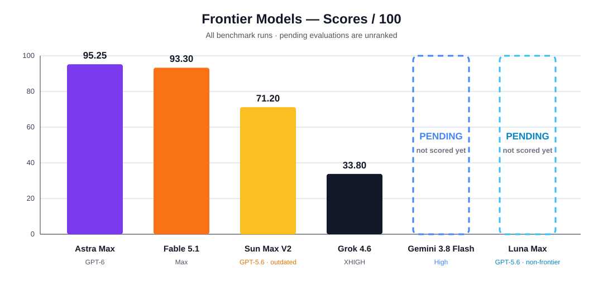

<div align="center">

# Benchmark do Sistema Solar / Orbitário

**Frontier Models · benchmark de geração de produto completo**

`3D / Canvas` · `simulação` · `design de produto` · `honestidade científica` · `UX responsiva` · `robustez`

[](./README.md)

</div>

## ⚔️ Arena Frontier V2 atual

| Modelo | Esforço | Projeto ao vivo | Snapshot / fonte |
| --- | --- | --- | --- |
| ✦ **GPT-6 Astra Max** | Max | [Abrir Astra](https://gpt-6-astra.biel.dev.br) | `fca2ef51b4…` |
| 𝕏 **Grok 4.6** | **XHIGH** | [Abrir Grok 4.6](https://grok-4-6-solar-system.vercel.app) | arquivo `5d77eeb509…` |
| ◆ **Fable 5.1** | **Max** | [Abrir Fable 5.1](https://fable-solar-system.vercel.app) | `7e079669e41b…` |
| ◈ **Gemini 3.8 Flash** | **High** | [Abrir Gemini 3.8 Flash](https://gemini-3.8-flash.biel.dev.br) | commit fonte `805cfe87a…` |

Os quatro concorrentes atuais usam exatamente o mesmo [`frontier-v2.md`](./prompts/frontier-v2.md).

> Os rótulos de raciocínio são preservados exatamente como metadados da execução. `Max`, `XHIGH` e `High` são configurações do fornecedor/execução e não são tratados como escalas de computação diretamente equivalentes.

## 🗂️ Modelos non-frontier ou desatualizados

Estes projetos continuam visíveis, mas ficam fora da arena frontier atual e não aparecem no SVG nem no ranking principal.

| Modelo | Classificação | Projeto / fonte | Proveniência | Situação da nota |
| --- | --- | --- | --- | --- |
| ☀️ **GPT-5.6 Sun Max V2** | Frontier desatualizado | [Abrir Sun V2](https://gpt-5.6-sun-v2.biel.dev.br) | commit `93d43ae62f…` · [`runs/gpt-5.6-sun-max/rebuild`](./runs/gpt-5.6-sun-max/rebuild/) | **71,20/100** histórica |
| 🌙 **GPT-5.6 Luna Max** | Non-frontier | [Repositório fonte](https://github.com/bielxdh3/orbitario-luna) | commit fonte [`5fdc036884…`](https://github.com/bielxdh3/orbitario-luna/commit/5fdc036884bbeb712eb015c76db1b1eaf83c9e42) | Fora do ranking principal |

O Luna Max está, por enquanto, apenas com a fonte fixada; a proveniência do prompt ainda não foi arquivada aqui.

<details>
<summary><strong>Baseline histórico — GPT-5.6 Sun Max V1</strong></summary>

O GPT-5.6 Sun Max V1 é preservado apenas para análise histórica do efeito do prompt. Ele é excluído da arena atual porque usou [`sun-original.md`](./prompts/sun-original.md), e não Frontier V2.

- [Abrir Sun V1](https://gpt-5.6-sun-v1.biel.dev.br)
- Snapshot: `67eb9fc51f…`
- Arquivo: [`runs/gpt-5.6-sun-max/original`](./runs/gpt-5.6-sun-max/original/)

</details>

## O que este benchmark testa

A tarefa pede ao modelo que transforme uma especificação extensa em uma experiência completa do Sistema Solar no navegador, e não apenas em uma demo simples. Ela testa interpretação da especificação, julgamento visual/de produto, estado orbital e temporal, sistemas aninhados como Terra–Lua, câmera/navegação, ferramentas de escala e medição, desempenho, confiabilidade, acessibilidade, honestidade científica e validação.

## Entrada compartilhada Frontier V2

```text
SHA-256  7c2833a0486938c38671139807bd4a8c16371c3740175376ad02a6c0c3c06d65
Tamanho  115.983 bytes
Linhas   1.153
```

## Mapa das execuções

| Execução | Modelo | Prompt | Proveniência | Arena |
| --- | --- | --- | --- | --- |
| Baseline histórico | GPT-5.6 Sun Max V1 | `sun-original.md` | commit `67eb9fc51f…` | oculto |
| Frontier V2 | GPT-5.6 Sun Max | `frontier-v2.md` | commit `93d43ae62f…` | non-frontier / desatualizado |
| Referência com fonte fixada | GPT-5.6 Luna Max | não arquivado aqui | commit fonte `5fdc036884…` | non-frontier |
| Frontier V2 | GPT-6 Astra Max | `frontier-v2.md` | commit `fca2ef51b4…` | atual |
| Frontier V2 / XHIGH | Grok 4.6 | `frontier-v2.md` | SHA-256 do arquivo `5d77eeb509…` | atual |
| Frontier V2 / Max | Fable 5.1 | `frontier-v2.md` | commit `7e079669e41b…` | atual |
| Frontier V2 / High | Gemini 3.8 Flash | `frontier-v2.md` | commit fonte `805cfe87a…` | atual |

A proveniência legível por máquina fica em [`RUNS.json`](./RUNS.json). O registro detalhado do Gemini está em [`GEMINI-3.8-FLASH-PROVENANCE.md`](./GEMINI-3.8-FLASH-PROVENANCE.md).

## Pontuações Frontier V2

> **Avaliação preliminar:** as notas foram feitas principalmente por um único avaliador e em poucos dispositivos/ambientes. O Gemini 3.8 Flash High está na arena, mas sua **avaliação prática está pendente**.

<div align="center">



</div>

| Posição | Modelo | Nota |
| ---: | --- | ---: |
| **1** | GPT-6 Astra Max | **95,25/100** |
| **2** | Fable 5.1 Max | **93,30/100** |
| **3** | Grok 4.6 XHIGH | **33,80/100** |
| — | Gemini 3.8 Flash High | **Pendente** |

## Critérios de avaliação — resumo

- **Completude de recursos — 20:** os recursos exigidos precisam existir e entregar o comportamento pretendido; implementações falsas, superficiais ou feitas para contornar a intenção perdem pontos.
- **Interação / UX — 15:** clareza, descobribilidade, ergonomia e fluxo dos controles quando o produto funciona como projetado; bugs comuns de implementação pertencem à Robustez.
- **Execução visual — 15:** hierarquia, legibilidade, coerência, qualidade de renderização e acabamento.
- **Fidelidade científica / da simulação — 15:** correção orbital, temporal, de escala e astronômica, além de limites de aproximação explicados com honestidade.
- **Robustez — 10:** bugs, dessincronização, estado de câmera/seguimento quebrado, exceções, estado corrompido e comportamentos que deixam de funcionar.
- **Desempenho — 10:** responsividade, estabilidade dos frames, carregamento e eficiência de recursos.
- **Código / arquitetura — 10:** manutenibilidade, modularidade, limites de estado, disciplina de dependências, testabilidade e qualidade da validação.
- **Acessibilidade / responsividade — 5:** teclado/foco, movimento reduzido, usabilidade semântica e adaptação do layout.

**Sem dupla penalização:** um defeito deve perder pontos na categoria principal à qual pertence, salvo quando houver evidência separada de outra violação. Estado de câmera/seguimento do Sol quebrado, por exemplo, é **Robustez**, não UX.

Veja [`comparison/SCORECARD.md`](./comparison/SCORECARD.md) para evidências detalhadas e notas por categoria.

## Política de snapshots

Arquivos produzidos pelos modelos são preservados dentro dos snapshots vendorizados em `runs/` sem edições do avaliador. Material escrito pelo avaliador permanece fora do resultado do modelo. Uma execução recém-adicionada pode ficar fixada em um commit Git exato enquanto o snapshot vendorizado completo ainda estiver pendente; esse estado fica explícito em `RUNS.json` em vez de ser apresentado como arquivo completo.

## Justiça da comparação

Um concorrente não deve receber a implementação, nota, crítica ou dicas posteriores de outro concorrente durante a geração do próprio projeto. O benchmark segue a regra: **primeiro geração, depois avaliação**.

---

<div align="center">

**Frontier Models · mesma tarefa, resultados inspecionáveis, evidências explícitas.**

</div>
